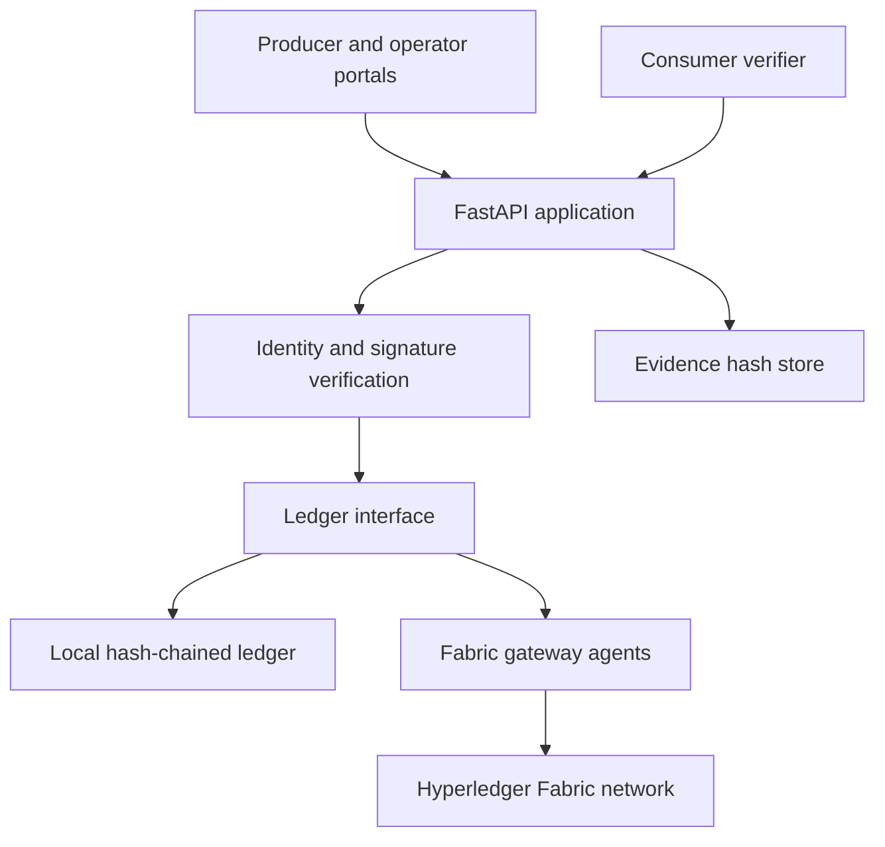

# OliveChain

[](https://github.com/AnasCHT/olivechain/actions/workflows/ci.yml)
[](LICENSE)

OliveChain is a blockchain-based traceability platform for olive-oil supply chains and agricultural waste management. It records cultivation, milling, laboratory evidence, custody transfers, residue recovery, transformation, and consumer verification in a tamper-evident ledger.

This repository contains the application developed and deployed by **Anas Chater** during a 2026 engineering internship. The project combines a FastAPI application with a Hyperledger Fabric network, cryptographic actor identities, off-chain evidence anchoring, and consumer-facing product passports.

## Project status

OliveChain is an engineering internship pilot and portfolio release. Its application logic, cryptographic audit trail, multilingual interface, and local demonstration are covered by automated tests. The included Fabric topology is designed for a four-machine consortium pilot; a production deployment still requires organization-owned infrastructure, managed certificates and secrets, monitoring, backup validation, and an agreed governance policy.

## Main capabilities

- Trace olive-oil batches from cultivation to consumer verification.
- Track olive residues through recovery and transformation workflows.
- Authenticate organizations and verify Ed25519 signatures for submitted events.
- Anchor off-chain evidence on the ledger with SHA-256 hashes.
- Detect implausible yields, duplicate events, and conflicting custody records.
- Generate multilingual product passports in English, French, and Arabic.
- Produce signed PDF passports, QR labels, and W3C Verifiable Credentials.
- Run either with the local append-only ledger or through Hyperledger Fabric gateway agents.
- Apply mass-balance controls and allocate non-transferable EcoPoints.

## Architecture



The Fabric deployment models four peer organizations and three Raft ordering organizations. Each peer maintains state in CouchDB. The domain chaincode implements the supply-chain workflow, governance rules, anomaly checks, incentives, wallets, and environmental-oracle records.

## Technology stack

| Area | Technologies |
| --- | --- |
| Application | Python 3.13, FastAPI, Uvicorn |
| Blockchain | Hyperledger Fabric 2.5, Fabric CA, Go chaincode |
| State database | CouchDB |
| Cryptography | Ed25519, SHA-256, W3C Verifiable Credentials |
| Web interface | HTML, CSS, JavaScript, WebCrypto, PWA |
| Deployment | Docker Compose, Caddy, HTTPS |
| Testing | pytest, Playwright, GitHub Actions |

## Repository structure

```text
olivechain/                 Core Python domain and ledger modules
frontend/                   Dashboard, actor portal, verifier and passports
demo/                       End-to-end pilot and passport generation
tests/                      Unit and integration tests
scripts/                    Administration, backup and verification tools
fabric-network/             Multi-machine Fabric network and Go chaincode
fabric-gateway-agent/       Per-organization Fabric Gateway service
docs/                       Project presentations and business workflows
serve.py                    FastAPI application entry point
```

## Local quick start

Requirements: Python 3.13 or later.

```bash
python -m venv .venv
source .venv/bin/activate       # Windows: .venv\Scripts\activate
pip install -r requirements.txt
python demo/run_pilot.py
uvicorn serve:app --reload
```

Open `http://localhost:8000` for the dashboard, `/portal` for the actor portal, `/verify` for consumer verification, and `/docs` for the API documentation.

The pilot creates runtime keys and ledger data under `data/`. These files are deliberately excluded from version control.

## Docker deployment

Copy the example configuration and replace every placeholder before deployment:

```bash
cp fabric-app.env.example fabric-app.env
docker compose up -d
```

Caddy serves the application over HTTPS. The default domain is `localhost`; set `OLIVECHAIN_DOMAIN` for an authorized production domain. Set `OLIVECHAIN_ADMIN_USER`, `OLIVECHAIN_ADMIN_PASSWORD`, and `OLIVECHAIN_ONBOARD_CODE` before exposing operator functions outside a development environment.

## Hyperledger Fabric deployment

The distributed network files are under [`fabric-network/`](fabric-network/README.md). The deployment uses four machines, four peer organizations, three Raft orderers, and one channel. Generated MSP material, private keys, certificates, channel blocks, ledgers, and packaged chaincode are excluded from this repository.

Install Node.js dependencies for a gateway agent with:

```bash
cd fabric-gateway-agent
npm ci
npm run check
```

## Tests

```bash
pip install -r requirements.txt -r requirements-dev.txt
python -m pytest tests/ -q
python demo/run_pilot.py
node scripts/verify_i18n.mjs
```

The browser test in `scripts/e2e_portal.py` verifies the WebCrypto signing flow with Playwright.

## Security design

- Every actor event is signed, validated against its registered public key, and checked against the role-permission matrix.
- Evidence remains off-chain; its SHA-256 digest is anchored to the event record.
- Corrections append a new event instead of deleting history.
- Writes are serialized to keep the previous-hash check and append operation atomic.
- Upload size, request rate, event uniqueness, payload shape, and evidence names are validated by the API.
- Private keys, credentials, runtime identities, logs, backups, and ledger state are excluded from version control.

The repository includes demonstration defaults and placeholder identifiers. Review the configuration, access controls, certificate lifecycle, and consortium governance rules before any production use.

## Documentation

- [Hyperledger Fabric presentation](docs/OliveChain-Hyperledger-Fabric-Presentation.pptx)
- [Business workflow presentation](docs/OliveChain-Business-Workflows.pptx)
- [Fabric network guide](fabric-network/README.md)
- [Gateway agent guide](fabric-gateway-agent/README.md)

## Author

**Anas Chater**, Cybersecurity Engineering student at the International University of Rabat

## License

Released under the [MIT License](LICENSE).
